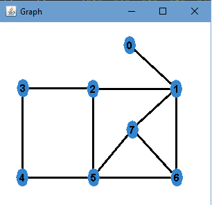
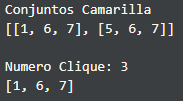
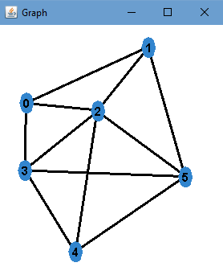
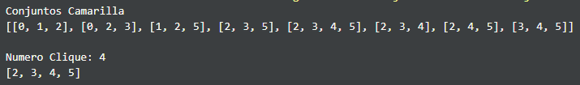
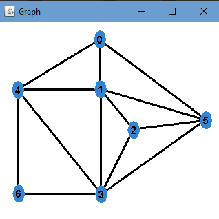
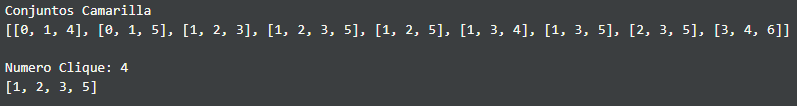

# Conjunto Camarilla y Número Clique
> Pantoja Bustamante Gabriel

## Conceptos Previos

> Un conjunto Camarilla es un conjunto de vértices adyacentes en el grafo, que forman un subgrafo completo.


> El numero clique o camarilla es el mayor número de vértices de un conjunto camarilla.

<hr>

# Algoritmo

**Representación:** Lista de Adyacencia.

La idea sera encontrar ciclos en un grafo, este ciclo formará los vertices de un subgrafo, luego de hallar este ciclo copiaremos las aristas asociadas a estos vertices del grafo original al subGrafo. Finalmente verificaremos si este subgrafo es completo, si lo es, lo agregamos a nuestra respuesta.

Para obtener el número clique la haremos al mismo tiempo que obtenemos los subgrafos completos, este valor sera actualizado, si el orden del subgrafo es mayor al valor actual del número clique.

```java
  @return Un ArrayList con todos los conjuntos camarilla que hay en el grafo.
  public ArrayList<HashSet<Integer>> conjuntosCamarilla()
```

```java
  @param v - Vertice origen de donde empieza el recorrido.
  @param vis - Arreglo que controla los vertices que ya fueron vistados.
  @param subGrafo - Grafo .
  @param c - Guarda todas las respuestas.
  @param root - Se usa para verificar si encontramos un ciclo.
  private void dfs(int v,boolean[] vis,Grafo subGrafo, ArrayList<HashSet<Integer>> c, int root)
```
<hr>

# Resultados

## Grafo 1

|              <center>Grafo</center>          |  <center>Consola</center>     |
|-------------------------------|-------------|
|    |    |

<hr/>

## Grafo 2

|              <center>Grafo</center>          |  <center>Consola</center>     |
|-------------------------------|-------------|
|    |    |

<hr/>

## Grafo 3

|              <center>Grafo</center>          |  <center>Consola</center>     |
|-------------------------------|-------------|
|    |    |

